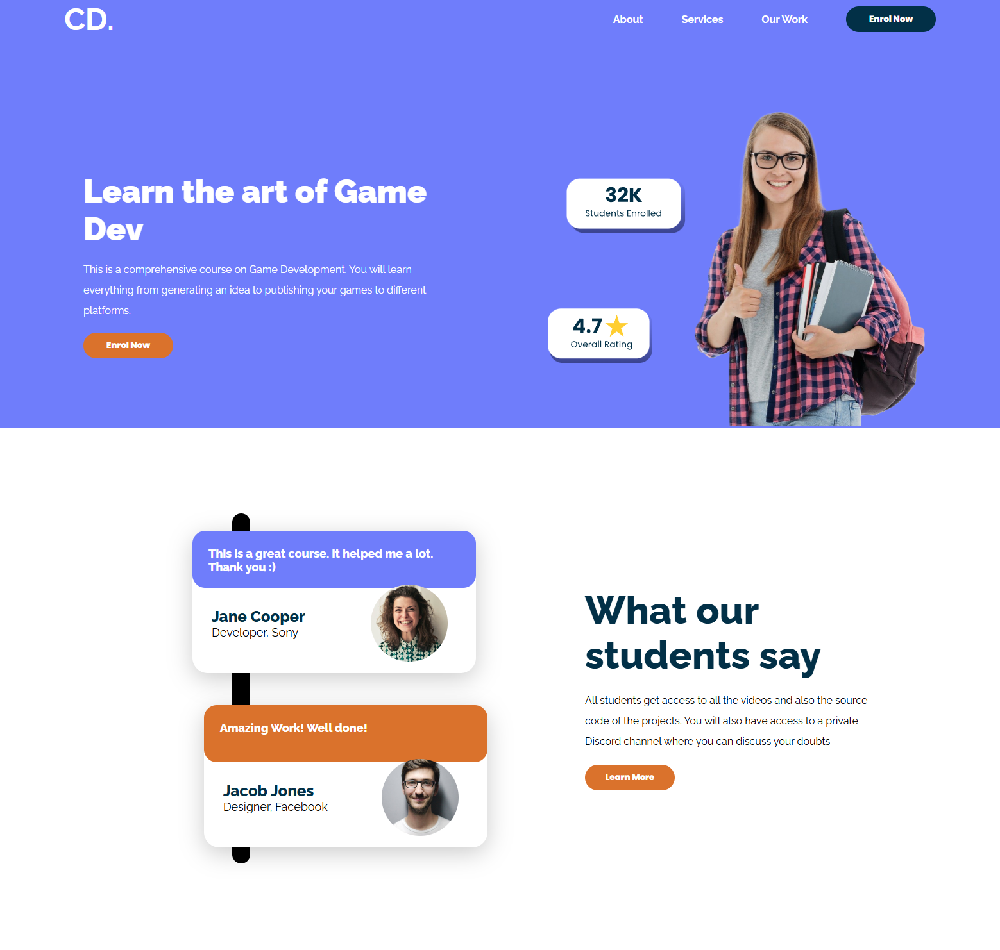
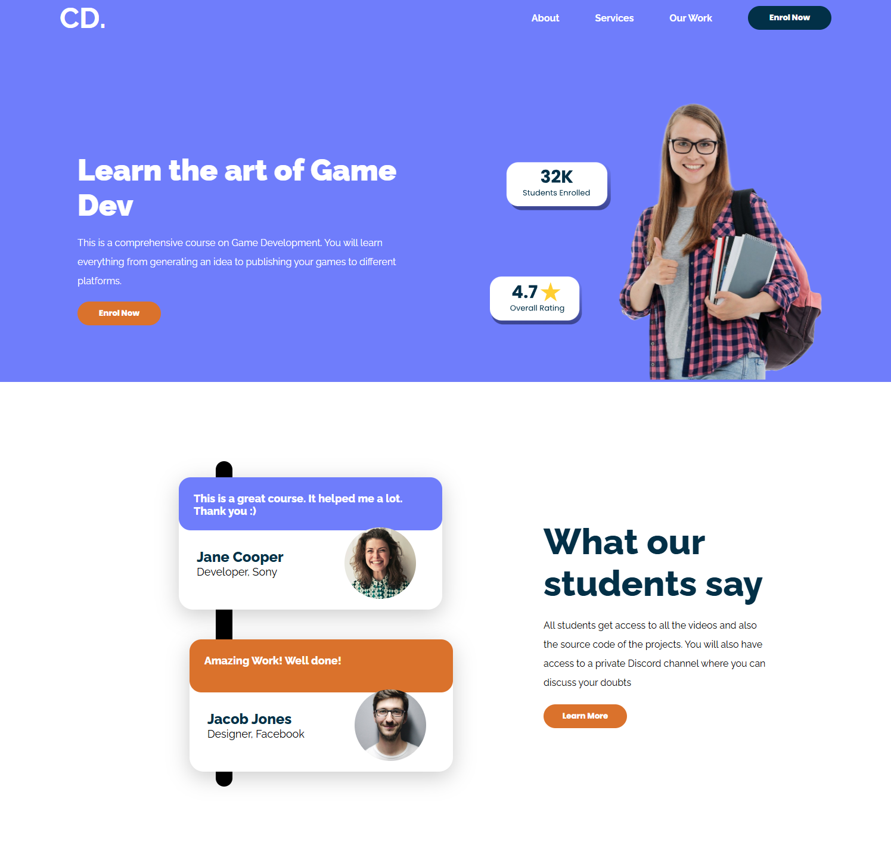
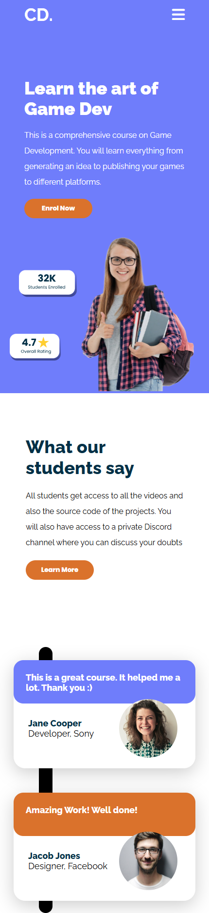

# Game Development Course Website

This is a responsive website designed to promote a comprehensive course on Game Development. The website includes a homepage with a hero section, testimonials, and a responsive navigation menu. It is built using HTML and SCSS.

## Features

- **Responsive Design**: The website is fully responsive and works seamlessly on desktop, tablet, and mobile devices.
- **Interactive Navigation**: A toggleable mobile menu for smaller screens.
- **Testimonials Section**: Displays feedback from students with a visually appealing layout.
- **Modern Styling**: Utilizes SCSS for modular and maintainable CSS, with variables for consistent theming.

## Technologies Used

- **HTML5**: For structuring the content.
- **SCSS**: For styling with variables, mixins, and nested rules.
- **Font Awesome**: For icons.
- **Google Fonts**: For typography (Raleway and Poppins).

## Folder Structure

Check out the live preview of the website:  
   👉 [Live Preview](https://saidoshits.github.io/GD_Project/)

## Preview

Here are some previews of the website:

### Desktop View


### Tablet View


### Mobile View


## Setup Instructions

1. **Clone the Repository**:
   ```bash
   git clone https://github.com/SaidosHits//GD_Project.git
   cd your-repo-name
